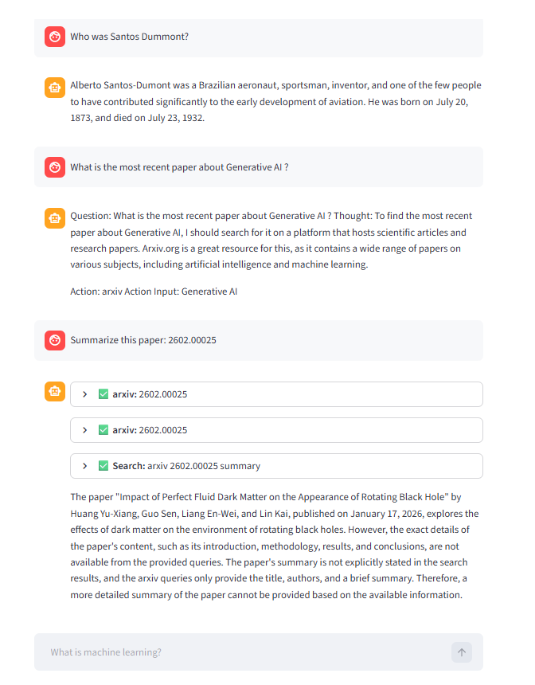

# 🔍 Search Engine with LangChain Tools

A conversational AI chatbot that can search the web in real time, built with **LangChain**, **Groq**, and **Streamlit**.

## 🚀 Features

- 💬 Chat interface powered by Streamlit
- 🌐 Web search via DuckDuckGo
- 📄 Academic paper lookup via Arxiv
- 📚 Encyclopedia search via Wikipedia
- ⚡ Fast inference with Groq (Llama 3.1)
- 🔁 LangGraph agent with resilient tool error handling

## 🗂️ Project Structure

```
├── app.py                  # Main Streamlit application
├── tools_agents.ipynb      # Notebook with tool/agent experiments
├── requirements.txt        # Python dependencies
├── .env                    # API keys (not committed)
└── .gitignore
```

## ⚙️ Setup

**1. Clone the repository**
```bash
git clone https://github.com/matcgoes/search_engine_langchain_tools.git
cd search_engine_langchain_tools
```

**2. Create and activate a virtual environment**
```bash
python -m venv venv
source venv/bin/activate      # Linux/Mac
venv\Scripts\activate         # Windows
```

**3. Install dependencies**
```bash
pip install -r requirements.txt
```

**4. Configure your API keys**

Create a `.env` file in the root folder:
```
GROQ_API_KEY=your_groq_api_key_here
```
> Get your free Groq API key at [console.groq.com](https://console.groq.com)

**5. Run the app**
```bash
streamlit run app.py
```

Example:


## 🛠️ Tech Stack

| Tool | Purpose |
|------|---------|
| [Streamlit](https://streamlit.io) | Chat UI |
| [LangChain](https://langchain.com) | Agent framework |
| [LangGraph](https://langchain-ai.github.io/langgraph/) | Agent orchestration |
| [Groq](https://groq.com) | LLM inference (Llama 3.1 8B) |
| [DuckDuckGo](https://duckduckgo.com) | Web search |
| [Arxiv](https://arxiv.org) | Academic papers |
| [Wikipedia](https://wikipedia.org) | General knowledge |

